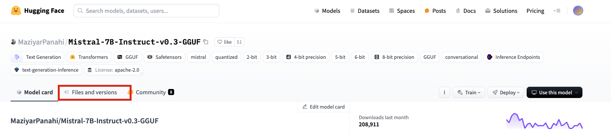
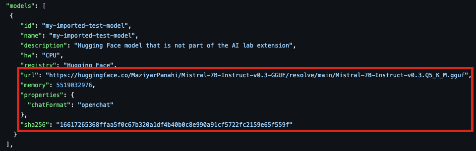

# Adding Custom Models

Podman Desktop AI Lab extension currently provides a list of models that come pre-packaged with the install. You can reference that list [here](https://github.com/containers/podman-desktop-extension-ai-lab/blob/main/packages/backend/src/assets/ai.json#L112-#L323). When deploying locally to Podman Desktop you are able to leverage these pre-packaged models for your application, however, you can add your own models if you wish. 

For example there is a [custom model](https://github.com/redhat-ai-dev/ai-lab-template-experiment/blob/main/skeleton/local-deploy/deployment/user-catalog.json#L20-#L34) added alongside the `non-ai-lab-chatbot` template.

## Setup

In order to add your own model(s) to the AI Lab extension you need to edit the [`user-catalog.json`](./skeleton/local-deploy/deployment/user-catalog.json) that is included as part of the software template. This file is what tells the extension what to import. The following steps can be taken to properly add a new model to the `user-catalog.json` file.

### Step 1: Finding The Model
- Navigate to [Hugging Face](https://huggingface.co/) and find a suitable [model](https://huggingface.co/models).
  - You will need a model in `GGUF` format for `llamacpp` model servers. 
- Find the file list for your [selected model](https://huggingface.co/MaziyarPanahi/Mistral-7B-Instruct-v0.3-GGUF/tree/main):

- Select the [size of the model](https://huggingface.co/MaziyarPanahi/Mistral-7B-Instruct-v0.3-GGUF/blob/main/Mistral-7B-Instruct-v0.3.Q5_K_M.gguf) you want to use.
- Note the `download link`, `sha` and `file size`:

### Step 2: Importing The Model
- Referencing the structure of [`user-catalog.json`](./skeleton/local-deploy/deployment/user-catalog.json), come up with an `id`, `name` and `description` for your imported model. Due to the resource restrictions typically experienced in local deployment you can leave `hw` as `CPU`. `registry` will be the repository you found the model (i.e. Hugging Face).

 

- Update the `url` and `sha` fields with the respective values you took note of above.
- Update the `memory` field with the `file size` you noted above in `bytes`. Typically this value is in a shortened form on Hugging Face.

### Step 3: Linking Model To Application
- Take note of the `id` you set for your model above.
- Add the new model `id` to your application in [`user-catalog.json`](./skeleton/local-deploy/deployment/user-catalog.json):

### Step 4: Selecting Your New Model
When you deploy to Podman Desktop you will be able to select which model you want to use before you start the application.

